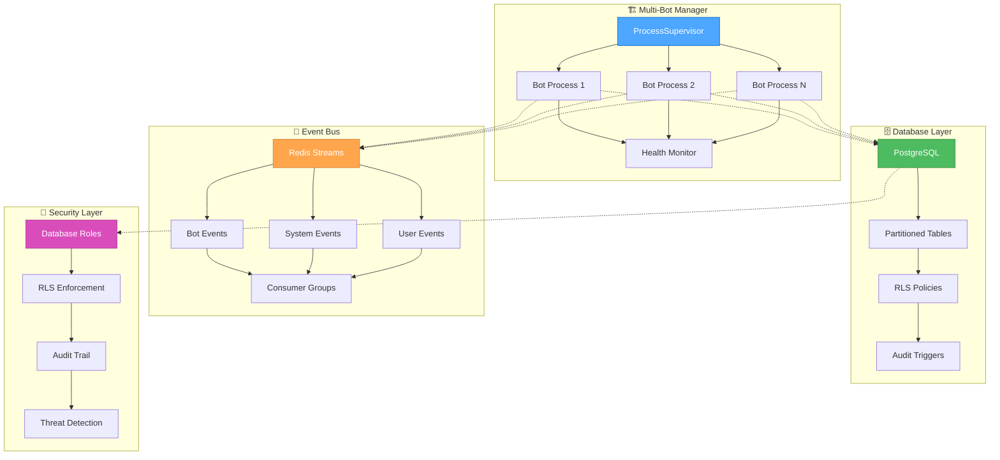

# 🎨 CREATIVE MODE COMPLETION SUMMARY

## All Creative Phase Components Completed ✅

### 1. ✅ Multi-Bot Manager Architecture Design
**File**: `creative_multibot_manager_design.md`
**Recommended Approach**: Process-Based Isolation
- ProcessSupervisor orchestrating isolated bot processes
- IPC communication через message queues
- Full fault isolation с OS-level resource management
- State machine for bot lifecycle management
- Health monitoring и automatic recovery

### 2. ✅ Database Schema Design  
**File**: `creative_database_schema_design.md`
**Recommended Approach**: Single Database with Bot ID Partitioning
- PostgreSQL с hash partitioning по bot_id
- Complete migration strategy от JSON files
- Row Level Security для data isolation
- Optimized indexing и query performance
- Comprehensive audit trail

### 3. ✅ Inter-Bot Communication Design (Event Bus)
**File**: `creative_event_bus_design.md`
**Recommended Approach**: Redis Streams Event Bus
- High-performance event streaming
- Consumer groups для multi-bot coordination
- Built-in persistence и replay capability
- Comprehensive event schema с standardized types
- Real-time monitoring и health checking

### 4. ✅ Multi-Tenant Security Model
**File**: `creative_security_model_design.md`
**Recommended Approach**: Database-Level Security (PostgreSQL RLS)
- PostgreSQL Row Level Security для bulletproof isolation
- Role-based access control с database roles
- Comprehensive audit system с database triggers
- Selective data encryption для sensitive information
- Real-time threat detection и monitoring

## Creative Phase Architecture Summary

## Design Decision Matrix

| Component | Technology Choice | Rationale |
|-----------|------------------|-----------|
| **Multi-Bot Manager** | Process-Based Isolation | Maximum fault isolation, OS-level resource management |
| **Database** | PostgreSQL Partitioning | Performance + simplicity balance, unified management |
| **Event Bus** | Redis Streams | High performance, built-in persistence, consumer groups |
| **Security** | PostgreSQL RLS | Database-enforced security, bulletproof isolation |

## Implementation Readiness Checklist

### Multi-Bot Manager ✅
- [x] ProcessSupervisor class specification
- [x] BotProcess wrapper design
- [x] IPC communication patterns
- [x] State machine diagrams
- [x] Error handling flowcharts

### Database Schema ✅
- [x] Complete PostgreSQL schema с partitioning
- [x] Migration scripts от JSON files
- [x] Row Level Security policies
- [x] Performance optimization indexes
- [x] Data validation constraints

### Event Bus ✅
- [x] Redis Streams architecture
- [x] Event schema и type definitions
- [x] Publisher/Consumer patterns
- [x] Consumer group configuration
- [x] Monitoring и health checking

### Security Model ✅
- [x] Database role hierarchy
- [x] RLS policy definitions
- [x] Audit trigger implementation
- [x] Authentication service design
- [x] Encryption service specification

## Creative Phase Artifacts Created

### Architecture Diagrams
- Multi-Bot Manager process architecture
- Database schema с relationships
- Event Bus topology с streams
- Security model с RLS policies

### Implementation Specifications
- Class hierarchies и interfaces
- Database schema DDL scripts
- Event type definitions
- Security policy configurations

### Migration Strategies
- JSON to PostgreSQL migration plan
- Process architecture transition
- Event Bus integration approach
- Security policy deployment

### Performance Optimizations
- Database indexing strategies
- Event Bus consumer group configurations
- Connection pooling optimizations
- Security check performance tuning

## Risk Mitigation Strategies

### Technical Risks
- **IPC Complexity** → Message queue patterns, proven libraries
- **Database Migration** → Phased approach, comprehensive validation
- **Redis Dependency** → Docker deployment, monitoring
- **Security Complexity** → PostgreSQL native features, testing

### Operational Risks
- **Memory Overhead** → Process limits, monitoring
- **Performance Impact** → Optimization strategies, benchmarking
- **Maintenance Complexity** → Documentation, automation
- **Recovery Procedures** → Backup strategies, rollback plans

## Integration Dependencies

### Technology Stack
- **Python 3.11+**: Core application language
- **PostgreSQL 14+**: Database с RLS support
- **Redis 6+**: Event streaming с streams support
- **Docker**: Deployment и service management
- **SQLAlchemy**: ORM integration
- **aioredis**: Async Redis client

### External Services
- **Telegram API**: Bot communication
- **OpenAI API**: AI response generation
- **Monitoring**: Prometheus/Grafana stack
- **Logging**: Structured logging с correlation

## Transition to IMPLEMENT Mode

### Implementation Order
1. **Database Schema** → Foundation for all other components
2. **Security Model** → Essential before any multi-bot operations
3. **Multi-Bot Manager** → Core orchestration system
4. **Event Bus** → Inter-bot communication
5. **Integration Testing** → End-to-end validation

### Development Phases
- **Phase 1**: Database migration и security setup
- **Phase 2**: Multi-Bot Manager implementation
- **Phase 3**: Event Bus integration
- **Phase 4**: Existing component refactoring
- **Phase 5**: REST API implementation
- **Phase 6**: Testing и production deployment

### Success Criteria
- All Creative Phase designs validated
- Implementation guidelines clear
- Dependencies identified и documented
- Risks mitigated с specific strategies
- Ready for direct implementation

## 🎨🎨🎨 CREATIVE MODE COMPLETED

**Status**: All 4 Creative Phase components successfully designed
**Next Mode**: IMPLEMENT Mode for direct implementation
**Artifacts**: Complete architectural specifications ready for coding
**Timeline**: Ready to begin implementation immediately

---

*"Design is not just what it looks like and feels like. Design is how it works."* - Steve Jobs

The Creative Phase has provided comprehensive architectural designs that balance performance, security, maintainability, and scalability for the multi-bot platform transformation.
