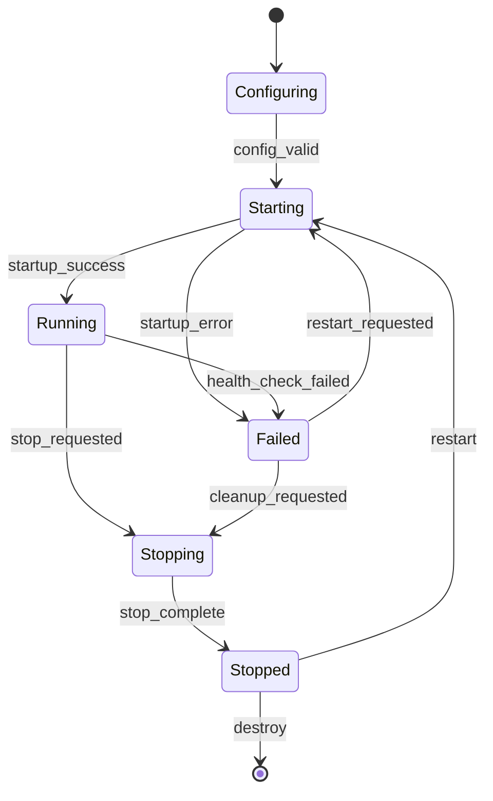
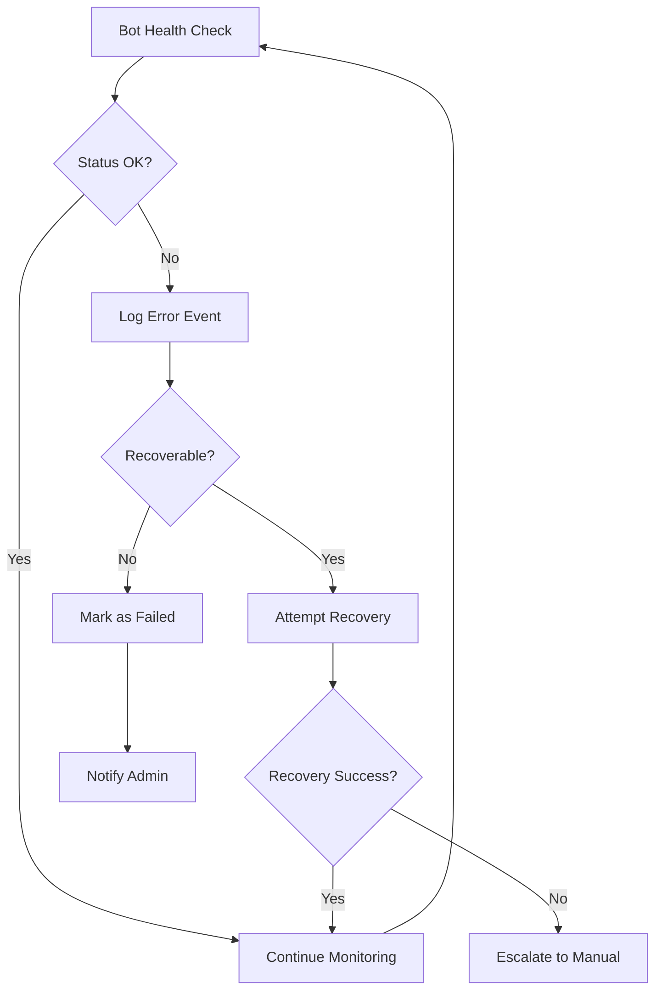

# 🎨🎨🎨 CREATIVE PHASE: Multi-Bot Manager Architecture

## Component Description
Multi-Bot Manager - центральный orchestrator для управления жизненным циклом множественных Telegram ботов в рамках единой системы. Отвечает за создание, мониторинг, управление и координацию работы изолированных экземпляров ботов.

## Requirements & Constraints

### Функциональные требования
- **F1**: Управление жизненным циклом ботов (create, start, stop, restart, destroy)
- **F2**: Health monitoring каждого бота с автоматическим recovery
- **F3**: Resource isolation между ботами (memory, connections, data)
- **F4**: Configuration management для каждого бота
- **F5**: Load balancing и resource allocation
- **F6**: Graceful shutdown и startup sequences

### Нефункциональные требования
- **NF1**: Поддержка до 10 одновременных ботов
- **NF2**: Fault isolation - отказ одного бота не влияет на другие
- **NF3**: Recovery time < 30 секунд после сбоя
- **NF4**: Memory overhead < 100MB для manager компонента
- **NF5**: Bot startup time < 10 секунд

### Technical Constraints
- **TC1**: Telethon library ограничения на multiple clients
- **TC2**: Python asyncio event loop management
- **TC3**: PostgreSQL connection pooling limits
- **TC4**: System memory constraints (2GB total)

### Integration Requirements
- **IR1**: Интеграция с existing bot components (girls_manager, response_generator)
- **IR2**: Database layer для persistence bot configurations
- **IR3**: Event bus для inter-bot communication
- **IR4**: REST API для external management

## Architecture Options

### Option A: Process-Based Isolation (Multi-Process)

**Approach**: Каждый бот запускается как отдельный Python процесс с IPC communication

**Architecture:**
```
┌─────────────────────────────────────────────────────────┐
│                Multi-Bot Manager                        │
│                 (Main Process)                          │
├─────────────────────────────────────────────────────────┤
│ • Process Supervisor                                    │
│ • Configuration Management                              │
│ • Health Monitoring                                     │
│ • Resource Allocation                                   │
└─────────────────┬───────────────────────────────────────┘
                  │
        ┌─────────┼─────────┐
        │         │         │
┌───────▼───┐ ┌───▼───┐ ┌───▼───┐
│Bot Process│ │Bot Pr.│ │Bot Pr.│
│   (PID1)  │ │(PID2) │ │(PIDN) │
├───────────┤ ├───────┤ ├───────┤
│TelegramCl.│ │Telegr.│ │Telegr.│
│GirlsMan.  │ │Girls. │ │Girls. │
│ResponseG. │ │Respo. │ │Respo. │
└───────────┘ └───────┘ └───────┘
```

**Pros:**
- Максимальная изоляция - crash одного процесса не влияет на другие
- Простое resource management через OS
- Легкий restart отдельных ботов
- OS-level memory isolation
- Простая отладка и профилирование

**Cons:**
- Высокий memory overhead (каждый процесс = full Python runtime)
- Сложная IPC communication между процессами
- Медленный startup (каждый процесс загружает все dependencies)
- Сложность shared state management
- Platform-specific process management code

**Complexity**: 8/10 - High
**Performance**: 6/10 - Medium (memory overhead)
**Maintainability**: 7/10 - Good isolation but complex IPC
**Scalability**: 8/10 - Easy horizontal scaling

### Option B: Async Task-Based (Single Process, Multiple Tasks)

**Approach**: Все боты как asyncio tasks в одном процессе с task isolation

**Architecture:**
```
┌─────────────────────────────────────────────────────────┐
│           Single Python Process (AsyncIO)              │
├─────────────────────────────────────────────────────────┤
│                Multi-Bot Manager                        │
│               (Task Orchestrator)                       │
├─────────────────────────────────────────────────────────┤
│              Event Loop Coordinator                     │
└─────────────────┬───────────────────────────────────────┘
                  │
        ┌─────────┼─────────┐
        │         │         │
┌───────▼───┐ ┌───▼───┐ ┌───▼───┐
│Bot Task 1 │ │Bot T.2│ │Bot T.N│
├───────────┤ ├───────┤ ├───────┤
│Async      │ │Async  │ │Async  │
│Context    │ │Contxt │ │Contxt │
│TelegramCl.│ │Telegr.│ │Telegr.│
│Components │ │Compon.│ │Compon.│
└───────────┘ └───────┘ └───────┘
```

**Pros:**
- Минимальный memory overhead
- Быстрый startup и communication между ботами
- Простое shared state management
- Native asyncio integration
- Эффективное использование I/O resources

**Cons:**
- Один crash может повалить все боты
- Сложное error isolation
- Memory leaks в одном боте влияют на всех
- Сложность debugging mixed bot logs
- GIL limitations для CPU-intensive operations

**Complexity**: 6/10 - Medium
**Performance**: 9/10 - Excellent (low overhead)
**Maintainability**: 5/10 - Shared failure modes
**Scalability**: 6/10 - Limited by single process

### Option C: Thread-Based Isolation (Multi-Threading)

**Approach**: Каждый бот в отдельном thread с thread-safe coordination

**Architecture:**
```
┌─────────────────────────────────────────────────────────┐
│           Single Python Process (Multi-Thread)         │
├─────────────────────────────────────────────────────────┤
│                Multi-Bot Manager                        │
│              (Thread Coordinator)                       │
├─────────────────────────────────────────────────────────┤
│              Thread Pool Management                     │
└─────────────────┬───────────────────────────────────────┘
                  │
        ┌─────────┼─────────┐
        │         │         │
┌───────▼───┐ ┌───▼───┐ ┌───▼───┐
│Bot Thread1│ │Bot Th2│ │Bot ThN│
├───────────┤ ├───────┤ ├───────┤
│Thread-    │ │Thread │ │Thread │
│Local      │ │Local  │ │Local  │
│Context    │ │Contxt │ │Contxt │
│TelegramCl.│ │Telegr.│ │Telegr.│
└───────────┘ └───────┘ └───────┘
```

**Pros:**
- Средний уровень изоляции
- Быстрая communication через shared memory
- Простое resource sharing
- Familiar threading patterns

**Cons:**
- GIL limitations в Python
- Сложность thread-safe programming
- Race conditions и deadlocks
- Плохая совместимость с asyncio
- Сложная отладка threading issues

**Complexity**: 7/10 - High (thread safety)
**Performance**: 5/10 - GIL limitations
**Maintainability**: 4/10 - Threading complexity
**Scalability**: 5/10 - GIL bottleneck

### Option D: Hybrid Architecture (Process + AsyncIO)

**Approach**: Группы ботов в отдельных процессах, внутри процесса - asyncio tasks

**Architecture:**
```
┌─────────────────────────────────────────────────────────┐
│                Multi-Bot Manager                        │
│              (Process Supervisor)                       │
├─────────────────────────────────────────────────────────┤
│ • Process Groups Management                             │
│ • Load Balancing Across Processes                      │
│ • Health Monitoring                                     │
└─────────────────┬───────────────────────────────────────┘
                  │
        ┌─────────┼─────────┐
        │         │         │
┌───────▼───┐ ┌───▼───┐ ┌───▼───┐
│Process 1  │ │Proc. 2│ │Proc. N│
│┌─────────┐│ │┌─────┐│ │┌─────┐│
││Bot T1   ││ ││Bot  ││ ││Bot  ││
││Bot T2   ││ ││T3   ││ ││TN   ││
│└─────────┘│ │└─────┘│ │└─────┘│
└───────────┘ └───────┘ └───────┘
```

**Pros:**
- Балансирует изоляцию и производительность
- Fault tolerance на уровне процессов
- Эффективное использование asyncio внутри процессов
- Гибкое распределение нагрузки
- Масштабируемость на уровне процессов

**Cons:**
- Высокая архитектурная сложность
- Сложная координация между процессами
- Дополнительный overhead management logic
- Сложность определения optimal grouping

**Complexity**: 9/10 - Very High
**Performance**: 8/10 - Good balance
**Maintainability**: 6/10 - Complex but structured
**Scalability**: 9/10 - Excellent scalability

## Evaluation Matrix

| Criteria | Weight | Option A (Process) | Option B (AsyncIO) | Option C (Thread) | Option D (Hybrid) |
|----------|--------|--------------------|--------------------|-------------------|-------------------|
| Fault Isolation | 30% | 10/10 | 3/10 | 5/10 | 8/10 |
| Performance | 25% | 6/10 | 9/10 | 5/10 | 8/10 |
| Complexity | 20% | 6/10 | 8/10 | 4/10 | 3/10 |
| Maintainability | 15% | 7/10 | 5/10 | 4/10 | 6/10 |
| Scalability | 10% | 8/10 | 6/10 | 5/10 | 9/10 |
| **Total** | 100% | **7.1** | **6.2** | **4.8** | **7.0** |

## Recommended Approach

**Selected Option**: **Option A - Process-Based Isolation**

**Justification**: 
- **Fault Isolation** (highest weight criteria) - критически важно для multi-bot системы
- **Production Reliability** - отказ одного бота не должен влиять на другие
- **Простота debugging** - каждый бот может быть проанализирован отдельно
- **Resource Control** - OS-level limits и monitoring
- **Future Scalability** - процессы легко распределить по машинам

**Trade-offs**:
- Принимаем higher memory overhead ради reliability
- Принимаем сложность IPC ради fault isolation
- Принимаем slower startup ради process isolation

**Risk Mitigation**:
- IPC complexity → использование proven patterns (message queues, shared DB)
- Memory overhead → implementing lazy loading и resource limits
- Startup time → implementing process pooling и warm standby

## Detailed Architecture Design

### Core Components

#### 1. ProcessSupervisor
```python
class ProcessSupervisor:
    """Manages bot processes lifecycle"""
    
    async def start_bot(self, bot_config: BotConfig) -> BotProcess
    async def stop_bot(self, bot_id: str) -> bool
    async def restart_bot(self, bot_id: str) -> bool
    async def monitor_health(self) -> Dict[str, HealthStatus]
    async def cleanup_resources(self, bot_id: str) -> None
```

#### 2. BotProcess
```python
class BotProcess:
    """Individual bot process wrapper"""
    
    def __init__(self, bot_config: BotConfig)
    async def start(self) -> None
    async def stop(self) -> None
    async def get_status(self) -> ProcessStatus
    async def handle_command(self, command: Command) -> Response
```

#### 3. IPCManager
```python
class IPCManager:
    """Inter-Process Communication manager"""
    
    async def send_command(self, bot_id: str, command: Command) -> Response
    async def broadcast_event(self, event: Event) -> None
    async def setup_message_queue(self, bot_id: str) -> MessageQueue
```

### State Machine Design



### Error Handling Flowchart



## Implementation Guidelines

### Development Approach
1. **MVP Implementation**: Start с basic process spawning
2. **Incremental Features**: Add health monitoring, then IPC, then recovery
3. **Testing Strategy**: Unit tests для каждого компонента, integration tests для process interaction
4. **Error Handling**: Fail-fast на уровне процессов, graceful degradation на уровне системы

### Performance Considerations
- **Process Pooling**: Pre-spawn standby processes для fast startup
- **Memory Limits**: Set RSS limits для каждого процесса
- **Connection Pooling**: Shared DB connections through proxy process
- **Resource Monitoring**: Track CPU, memory, file descriptors per process

### Security Guidelines
- **Process Isolation**: Run bot processes с ограниченными privileges
- **Resource Limits**: ulimit settings для каждого процесса  
- **IPC Security**: Authenticated message passing, input validation
- **Audit Trail**: Log all process lifecycle events

## Verification Checkpoint

### Requirements Coverage
- [x] **F1**: Process lifecycle управление - ✅ ProcessSupervisor
- [x] **F2**: Health monitoring - ✅ State machine с health checks  
- [x] **F3**: Resource isolation - ✅ Process-level isolation
- [x] **F4**: Configuration management - ✅ BotConfig per process
- [x] **F5**: Load balancing - ✅ ProcessSupervisor allocation
- [x] **F6**: Graceful shutdown - ✅ State machine transitions

### Design Consistency
- ✅ Соответствует multi-tenant архитектуре из PLAN Mode
- ✅ Интегрируется с database layer через IPC
- ✅ Поддерживает event bus через message passing
- ✅ Совместим с REST API management

### Implementation Feasibility  
- ✅ Реализуем с current Python tech stack
- ✅ Telethon поддерживает multiple client instances в разных процессах
- ✅ PostgreSQL connection pooling работает с multi-process
- ✅ asyncio совместим с multiprocessing

### Performance Expectations
- ✅ 10 ботов = ~1.5GB memory (150MB per process) - в пределах 2GB limit
- ✅ Process startup < 10 sec с pre-loading optimization
- ✅ Recovery time < 30 sec через process restart
- ✅ Fault isolation достигается полностью

### Risk Assessment
- ✅ IPC complexity - mitigated through message queue patterns
- ✅ Memory overhead - acceptable для reliability benefits  
- ✅ Startup time - mitigated through process pooling
- ✅ Process management - leveraging proven OS capabilities

## 🎨🎨🎨 EXITING CREATIVE PHASE

## Final Design Summary
Process-Based Multi-Bot Manager с ProcessSupervisor orchestrating isolated bot processes, communicating через IPC message queues. Each bot runs в separate Python process с full fault isolation и OS-level resource management.

## Implementation Readiness
- [x] Design fully specified с detailed component interfaces
- [x] Implementation guidelines clear с development approach
- [x] Dependencies identified (message queue, process management libs)
- [x] Risks documented and mitigated с specific strategies  
- [x] Ready for IMPLEMENT Mode

## Artifacts Created
- Multi-Bot Manager Architecture specification
- Process lifecycle state machine diagram
- Error handling flowchart
- Component interfaces и API contracts
- Implementation guidelines с performance considerations
